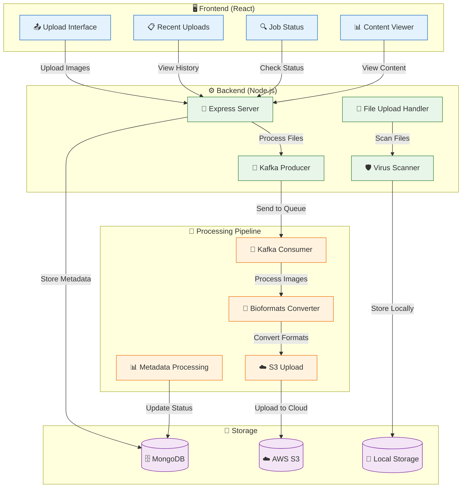

# Blood Smear Database Application

A comprehensive web application for uploading, processing, and managing blood smear images for exotic animals at UC Davis School of Veterinary Medicine. Built with React, Node.js, and Apache Kafka for real-time image processing.

## 🏥 Overview

This application provides a complete solution for veterinary researchers and clinicians to upload, process, and analyze blood smear images from exotic animals. The system supports both whole slide images and cellavision images with automated processing pipelines.

## 🏗️ Architecture

### System Architecture

### Image Processing Flow

```mermaid
flowchart LR
    subgraph Upload["📤 Upload Process"]
        direction TB
        A["📁 File Selection"]
        B["📝 Metadata Entry"]
        C["🛡️ Virus Scan"]
        D["📤 Upload to Server"]
    end

    subgraph Queue["🔄 Processing Queue"]
        direction TB
        E["📨 Kafka Topic"]
        F["⏳ Job Queue"]
    end

    subgraph Processing["🔧 Image Processing"]
        direction TB
        G["🔄 Bioformats Conversion"]
        H["📊 TIFF Processing"]
        I["🖼️ Image Optimization"]
    end

    subgraph Storage["💾 Storage & Access"]
        direction TB
        J["☁️ S3 Upload"]
        K["📊 Metadata Update"]
        L["✅ Status Complete"]
    end

    A --> B
    B --> C
    C --> D
    D --> E
    E --> F
    F --> G
    G --> H
    H --> I
    I --> J
    J --> K
    K --> L

    %% Styling
    classDef upload fill:#e3f2fd,stroke:#1565c0
    classDef queue fill:#fff3e0,stroke:#ef6c00
    classDef processing fill:#e8f5e9,stroke:#2e7d32
    classDef storage fill:#f3e5f5,stroke:#7b1fa2

    class A,B,C,D upload
    class E,F queue
    class G,H,I processing
    class J,K,L storage
```

## 🚀 Key Features

- **📤 Multi-format Upload**: Support for TIFF, VSI, and JPG images
- **🔄 Real-time Processing**: Apache Kafka-based asynchronous processing
- **🛡️ Security**: Integrated virus scanning with ClamAV
- **☁️ Cloud Storage**: AWS S3 integration with CloudFront CDN
- **📊 Metadata Management**: Comprehensive specimen information tracking
- **🔍 Advanced Viewer**: TIFF image conversion and display
- **📱 Responsive Design**: Mobile-friendly interface
- **🔐 Authentication**: Secure user management system

## 🛠️ Technology Stack

### Frontend
- **React 19** - Modern UI framework
- **Vite** - Fast build tool and dev server
- **React Router** - Client-side routing
- **UTIF** - TIFF image processing
- **CSS3** - Modern styling with gradients and animations

### Backend
- **Node.js** - Runtime environment
- **Express.js** - Web framework
- **MongoDB** - Document database
- **Apache Kafka** - Message streaming
- **Multer** - File upload handling
- **AWS SDK** - Cloud storage integration

### Infrastructure
- **Docker** - Containerization
- **ClamAV** - Virus scanning
- **Bioformats** - Image format conversion
- **AWS S3** - Cloud storage
- **CloudFront** - CDN distribution

## 📋 Prerequisites

- **Node.js** 18+ and npm
- **Docker** and Docker Compose
- **MongoDB** (local or cloud)
- **AWS Account** (for S3 storage)
- **4GB+ RAM** for running all services

