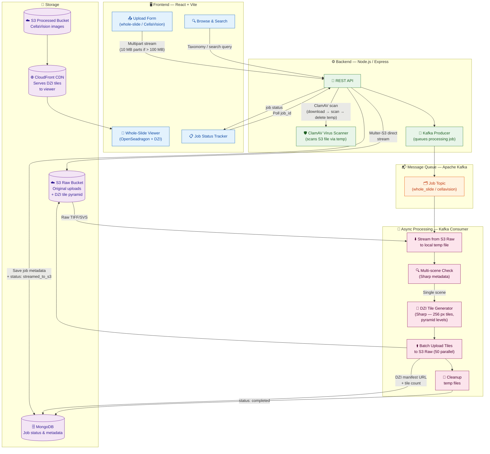

# Blood Smear Image Database

> A production-grade research platform for uploading, processing, and browsing high-resolution blood smear images from exotic and endangered animals — built at UC Davis School of Veterinary Medicine.

---

## Overview

The Blood Smear Database provides veterinary researchers, clinicians, and students with a searchable digital archive of rare hematological specimens. The platform handles two image modalities: **whole-slide images** (large multi-gigabyte TIFF/SVS files) and **CellaVision images** (per-cell-type JPEG captures), each with its own processing pipeline.

---

## Demo video

[Watch — *The Digital Ark for Animal Blood*](docs/media/The_Digital_Ark_for_Animal_Blood.mp4) (MP4 in this repository.)

---

## System Architecture


```mermaid
flowchart TB
    subgraph Frontend["🖥️ Frontend — React + Vite"]
        direction TB
        A["📤 Upload Form\n(whole-slide / CellaVision)"]
        B["🔍 Browse & Search"]
        C["🔬 Whole-Slide Viewer\n(OpenSeadragon + DZI)"]
        D["📋 Job Status Tracker"]
    end

    subgraph Backend["⚙️ Backend — Node.js / Express"]
        direction TB
        E["📡 REST API"]
        F["🛡️ ClamAV Virus Scanner\n(scans S3 file via temp)"]
        G["📨 Kafka Producer\n(queues processing job)"]
    end

    subgraph Queue["📬 Message Queue — Apache Kafka"]
        H["🗂️ Job Topic\n(whole_slide / cellavision)"]
    end

    subgraph Processing["🔧 Async Processing — Kafka Consumer"]
        direction TB
        I["⬇️ Stream from S3 Raw\nto local temp file"]
        J["🔍 Multi-scene Check\n(Sharp metadata)"]
        K["🧩 DZI Tile Generator\n(Sharp — 256 px tiles,\npyramid levels)"]
        L["⬆️ Batch Upload Tiles\nto S3 Raw (50 parallel)"]
        M["🧹 Cleanup\ntemp files"]
    end

    subgraph Storage["💾 Storage"]
        N[("🗄️ MongoDB\nJob status & metadata")]
        O[("☁️ S3 Raw Bucket\nOriginal uploads\n+ DZI tile pyramid")]
        P[("☁️ S3 Processed Bucket\nCellaVision images")]
        Q[("🌐 CloudFront CDN\nServes DZI tiles\nto viewer")]
    end

    A -->|"Multipart stream\n(10 MB parts if > 100 MB)"| E
    E -->|"Multer-S3 direct\nstream"| O
    E -->|"ClamAV scan\n(download → scan → delete temp)"| F
    E -->|"Save job metadata\n+ status: streamed_to_s3"| N
    E --> G
    G --> H
    H --> I

    I --> J
    J -->|"Single scene"| K
    K --> L
    L --> M
    L -->|"DZI manifest URL\n+ tile count"| N
    M -->|"status: completed"| N

    O -->|"Raw TIFF/SVS"| I
    L --> O
    P --> Q
    Q --> C

    B -->|"Taxonomy / search query"| E
    D -->|"Poll job_id"| E
    E -->|"job status"| D

    classDef fe fill:#e3f2fd,stroke:#1565c0,color:#0d47a1
    classDef be fill:#e8f5e9,stroke:#2e7d32,color:#1b5e20
    classDef queue fill:#fff3e0,stroke:#e65100,color:#bf360c
    classDef proc fill:#fce4ec,stroke:#880e4f,color:#4a0030
    classDef store fill:#f3e5f5,stroke:#6a1b9a,color:#311b92

    class A,B,C,D fe
    class E,F,G be
    class H queue
    class I,J,K,L,M proc
    class N,O,P,Q store
```

---

## Whole-Slide Image Processing Pipeline

Large TIFF and SVS files (often 1–4 GB) cannot be served directly to a browser. The system converts them into a **Deep Zoom Image (DZI)** pyramid — a format where each zoom level is pre-sliced into 256 × 256 pixel tiles. The browser viewer (OpenSeadragon) requests only the tiles visible in the current viewport, enabling smooth pan and zoom of gigapixel images without loading the entire file.


```mermaid
flowchart LR
    subgraph Upload["📤 Upload"]
        direction TB
        A["File selected\n(TIFF · SVS · NDPI · PNG · JPEG)"]
        B["Metadata entered"]
        C["ClamAV virus scan\n(via S3 temp download)"]
        D["Multer-S3 stream\nto Raw S3 bucket\n⚡ Multipart if > 100 MB"]
    end

    subgraph Queue["📬 Kafka Queue"]
        E["Job message:\njob_id · s3_key · type"]
    end

    subgraph DZI["🧩 DZI Processing (Sharp)"]
        direction TB
        F["Stream raw file\nfrom S3 → local temp"]
        G["Multi-scene check\n(Sharp metadata · pages)"]
        H["Generate tile pyramid\n256 px tiles · 0 px overlap\nAll zoom levels"]
        I["Upload tiles to S3\nin batches of 50 (parallel)\nProgress logged per batch"]
        J["Upload DZI manifest\n(.dzi XML descriptor)"]
        K["Cleanup temp files\n(input + output dirs)"]
    end

    subgraph Serve["🌐 Delivery"]
        L["CloudFront CDN\nserves tiles on demand"]
        M["OpenSeadragon viewer\nrequests only visible tiles"]
    end

    subgraph DB["🗄️ MongoDB"]
        N["status: streamed_to_s3\n→ processing\n→ completed / failed"]
    end

    A --> B --> C --> D
    D --> E
    E --> F --> G --> H --> I
    I --> J --> K
    I -->|"dzi_url\npyramid_levels\ntile_count"| N
    K --> N
    J --> L --> M

    classDef upload fill:#e3f2fd,stroke:#1565c0,color:#0d47a1
    classDef queue fill:#fff3e0,stroke:#e65100,color:#bf360c
    classDef dzi fill:#fce4ec,stroke:#880e4f,color:#4a0030
    classDef serve fill:#e8f5e9,stroke:#2e7d32,color:#1b5e20
    classDef db fill:#f3e5f5,stroke:#6a1b9a,color:#311b92

    class A,B,C,D upload
    class E queue
    class F,G,H,I,J,K dzi
    class L,M serve
    class N db
```

### Why Deep Zoom?

| Challenge | Solution |
|---|---|
| TIFF/SVS files are 1–4 GB | Streamed from S3, never fully loaded into memory |
| Browser can't open raw WSI formats | Sharp converts to standard JPEG tiles |
| Serving gigapixel images is slow | DZI pyramid: only tiles for the current viewport are fetched |
| Uploads > 100 MB time out | S3 multipart upload (10 MB parts, 4 concurrent streams) |
| Processing blocks the web server | Decoupled via Kafka — API returns instantly, processing is async |

---

## Key Features

- **Whole-Slide Imaging** — DZI tile pyramid generation from TIFF/SVS with OpenSeadragon pan-and-zoom viewer
- **CellaVision Support** — Per-cell-type image uploads organized by hematological category
- **Async Processing** — Apache Kafka decouples upload from processing; job status tracked in real time
- **Virus Scanning** — ClamAV scans every file after S3 upload before processing begins
- **Dual S3 Buckets** — Raw bucket holds originals and DZI tiles; Processed bucket holds CellaVision outputs
- **CloudFront CDN** — DZI tiles served at edge for low-latency pan-and-zoom worldwide
- **Taxonomy Search** — Browse by phylum, class, species; filter by health status, stain type, and more
- **Multipart Upload** — Files over 100 MB automatically use S3 multipart (10 MB parts, 4 parallel streams)
- **Metadata Schema** — Comprehensive specimen data: taxonomy, collection date, stain, magnification, clinical notes

---

## Technology Stack

### Frontend
| | |
|---|---|
| **React 19** | Component framework |
| **Vite** | Build tool & dev server |
| **React Router 7** | Client-side routing |
| **OpenSeadragon** | Whole-slide DZI viewer |
| **Plain CSS** | Design system (UC Davis palette) |

### Backend
| | |
|---|---|
| **Node.js / Express** | REST API server |
| **MongoDB / Mongoose** | Job metadata & specimen records |
| **Apache Kafka** | Async image processing queue |
| **Multer-S3** | Direct-to-S3 multipart streaming |
| **Sharp** | DZI pyramid tile generation |
| **ClamAV / NodeClam** | Virus scanning |
| **AWS SDK** | S3 + CloudFront integration |

### Infrastructure
| | |
|---|---|
| **AWS S3 (×2)** | Raw uploads + processed outputs |
| **AWS CloudFront** | CDN for DZI tile delivery |
| **MongoDB Atlas** | Managed database |
| **Apache Kafka** | Message streaming (Docker) |
| **Docker** | Service containerization |

---

## Prerequisites

- **Node.js** 18+
- **Docker & Docker Compose** (Kafka + ClamAV)
- **MongoDB** (local or Atlas)
- **AWS Account** — two S3 buckets + CloudFront distribution
- **4 GB+ RAM** to run all services locally

---

## Project Structure

```
Blood-Smear-Database-App/
├── frontend/
│   └── blood-smear-frontend/
│       └── src/
│           ├── routes/          # Page components
│           ├── Component/       # Shared UI components
│           └── assets/          # Images & static files
└── backend/
    └── blood-smear-backend/
        ├── controller/          # Request handlers
        ├── Kafka/               # Producer & consumer
        ├── models/              # Mongoose schemas
        ├── routes/              # Express routes
        └── utility/
            ├── dziProcessor.js  # Sharp DZI tile pipeline
            ├── S3Upload.js      # S3 streaming & multipart
            └── virusScanner.js  # ClamAV integration
```

---

## Acknowledgments

Built by **Sakshi Singh** (M.S. Computer Science, UC Davis) in collaboration with:

- **Dr. Melanie Audrey Ammersbach** — Principal Investigator, Pathology, Microbiology & Immunology
- **Professor Hugues Beaufrere** — Co-Investigator, Pathology, Microbiology & Immunology
- UC Davis School of Veterinary Medicine
- Wildlife veterinarians and zoological institutions worldwide who contributed specimens

---

*© UC Davis School of Veterinary Medicine · Blood Smear Image Database*
